# Predict death cases for COVID-19

Coronavirus disease (COVID-19) is an infectious disease caused by the SARS-CoV-2 virus.

Most people infected with the virus will experience mild to moderate respiratory illness and recover without requiring special treatment. However, some will become seriously ill and require medical attention. Older people and those with underlying medical conditions like cardiovascular disease, diabetes, chronic respiratory disease, or cancer are more likely to develop serious illness. Anyone can get sick with COVID-19 and become seriously ill or die at any age. 

The best way to prevent and slow down transmission is to be well informed about the disease and how the virus spreads. Protect yourself and others from infection by staying at least 1 metre apart from others, wearing a properly fitted mask, and washing your hands or using an alcohol-based rub frequently. Get vaccinated when it’s your turn and follow local guidance.

The virus can spread from an infected person’s mouth or nose in small liquid particles when they cough, sneeze, speak, sing or breathe. These particles range from larger respiratory droplets to smaller aerosols. It is important to practice respiratory etiquette, for example by coughing into a flexed elbow, and to stay home and self-isolate until you recover if you feel unwell.

# Step by step process to predict death cases.

## Step 1: Review and Tidying the datasets.

### Obtain the datasets:
Datasets are the most relevant point for whatever Machine Learning project, in the case of the current pandemia caused for the SARS-Co2 virus, the speculation about deaths, positive cases, and vaccination, generates a lot of noise in the real statistics for each country reports. To be sure that the data is closer to reality, the datasets were obtained from Jhon Hopkins University API that filter the official reports in World Health Organization -WHO-. 

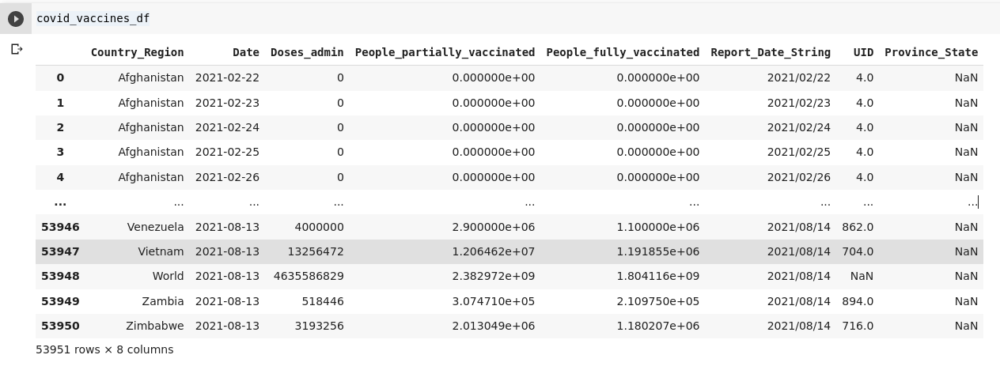

### Fix structural errors:
Remove unwanted observations from COVID dataset and structural errors, notice strange naming conventions, typos, or incorrect capitalization between positive cases, deaths, and vaccination datasets, and variable names in the datasets were normalizing, because these inconsistencies can cause mislabeled categories or classes.

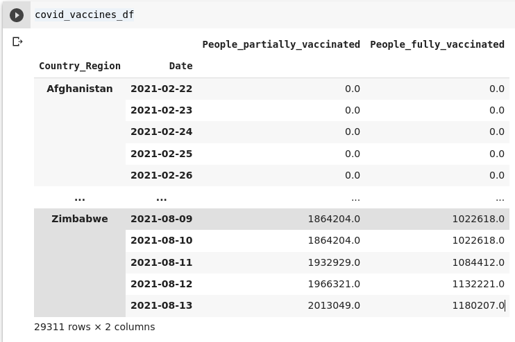

### Filter unwanted outliers:
Often, there will be one-off observations for some countries where, at a glance, they do not appear to fit within the data. In case of countries like Ecuador, France, and Italy, their datasets contains negative values and any picks like strange impulse in some days of the time series.

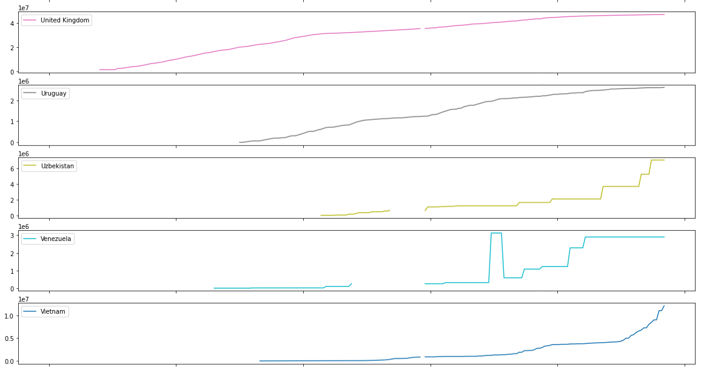

### Handle missing data:
As a first option, missing observations were dropped and filling using the inmediately previous day value -Forward filling-.

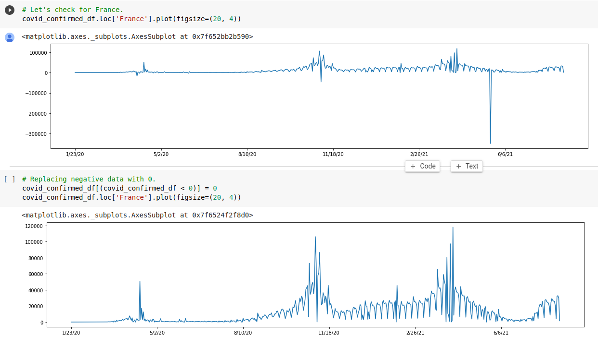

### Apply a smothing algorithm:
The smoothing techniques are the members of time series forecasting methods or algorithms, which use the weighted average of a past observation to predict the future values or forecast the new value. These techniques are well suited for time-series data having fewer deviations with time. In the case of COVID data, it shows a periodic pattern with a lower index on weekend days with higher values on Monday due to sub-reporting on weekends.

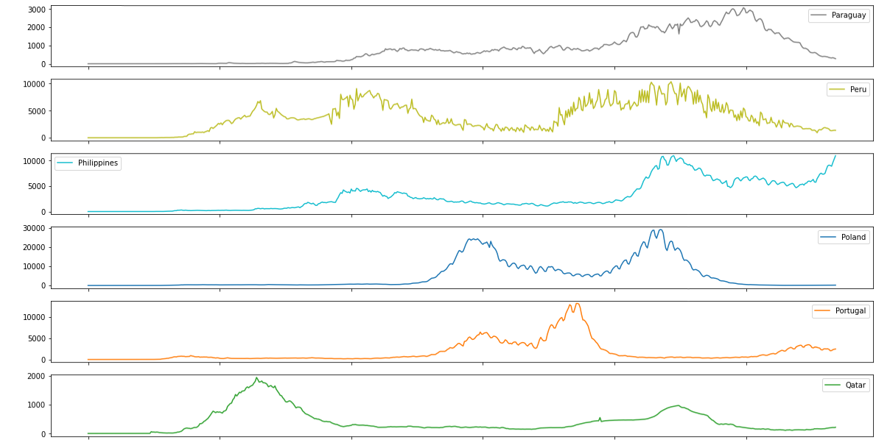

### Validate and QA
False conclusions because of incorrect or “dirty” data can inform poor business strategy and decision-making. False conclusions can lead to an embarrassing moment in a reporting meeting when you realize your data doesn’t stand up to scrutiny. At the end of this tidy process, the data for each country shows a smoother plot of daily data without outliers.

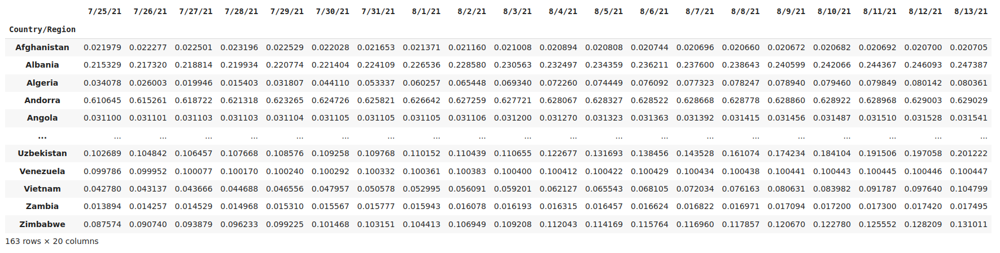

## Step 2: Normalize and spit the data.

### Normalize the data:
COVID-19 data require to be normalized by the total population or max number of positive cases for each country. This criterion is based on the fact that the difference in enumeration unit size for every country can alter how a spatial distribution appears, and the scale for 3 variables that were used in the project reflects a real effect in the final prediction.

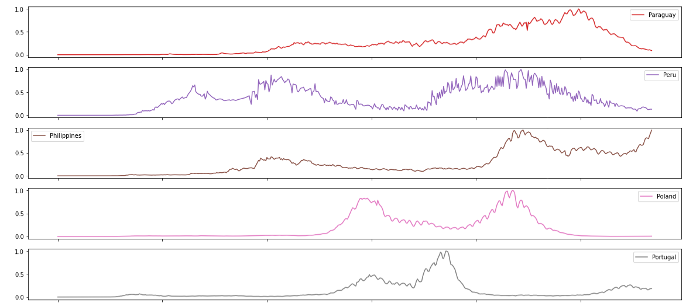

### Split data by regions:
The data was split into different geographical regions: Asia, Europe, Africa, North and Central America, South America, Oceania.

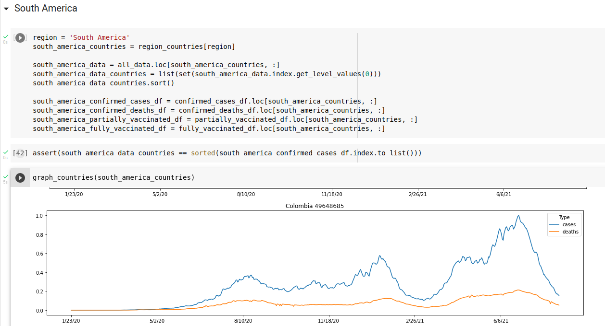

### Split the data into Test and validation:
The variables that it was considered to train the model were fully vaccinated population percentage that is the percentage of the country population that vaccination scheme is completed; partially vaccinated population percentage that is the percentage of the country population that vaccination scheme started but remains for the last dose; The total number of cases per day per country normalized to the total of population. The label variable is the number of total deaths per day per country.

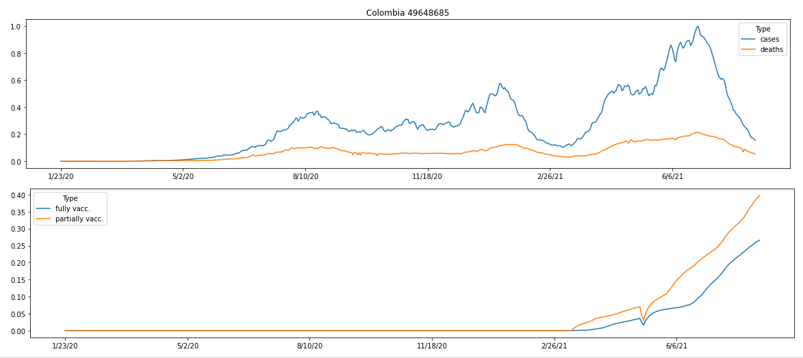

## Step 3: Train the Model

The implemented model is composed of 3 Neural Network layers. The first one is an LSTM Recurrent Neural Network with 32 units, the second layer is a dense Neural Network layer, and the last layer is an output layer composed of a neuron. The RNN was tuned by 100 ephocs, Huber losses, Adam optimizer, and the mean_absolute_percentage_error as a main metric.

# Results and Discussion

We predict the number of daily deaths for COVID-19 during current pandemia using artificial intelligence. The accuracies of simulation of deaths for COVID-19 are high. So, the RNN can be used for simulations. The results show that using country data by region has the best performance. The 3 input variables are selected to create an RNN model. We also can use the RNN with Long Short-Term Memory (LSTM) to predict the number of virus epidemic outbreaks in the future.

We provide a simple AI model for this project to understand the behavior of deaths for COVID-19 from 2020 january data based on specific estimates of global past historical data. The actual data of the confirmed case of COVID-19 in progress is not well-matched with that of AI, which strongly shows that it is suitable for simulating the epidemic caused by SARS-CoV-2. 

The percentage error decrease drastically throws the ephocs but it is ridiculously high in the order of 10⁶.

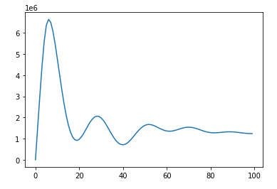

This are the result for some south american countries. In the top: Red line represents the real number of daily deaths, Green line represents the predicted number of deaths by the model, Blue line is the positive cases in scale 1:40 (just to fit in the plot window), and the bottom subplot shows the percentage of partially and fully vaccined population.

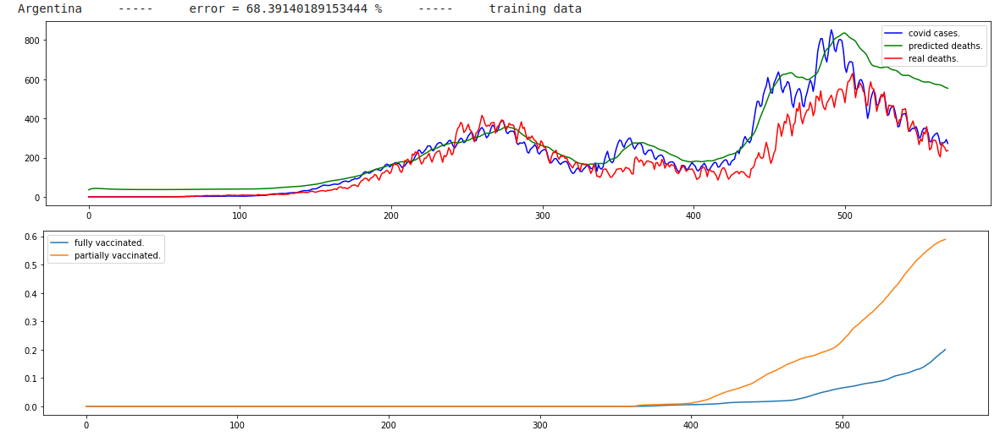

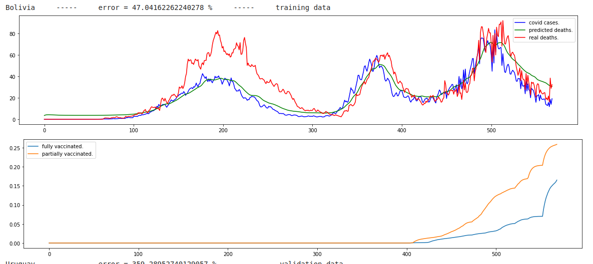
 

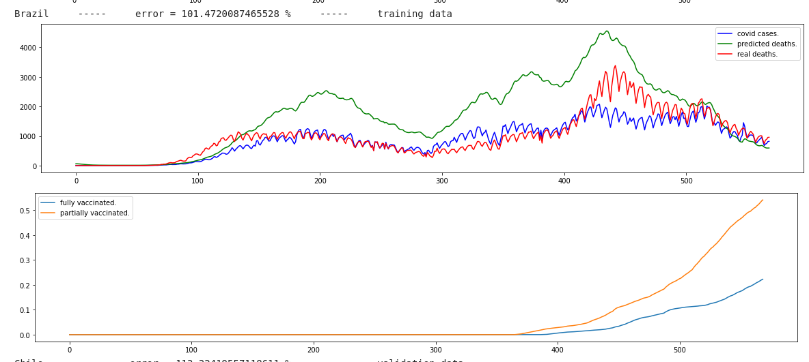

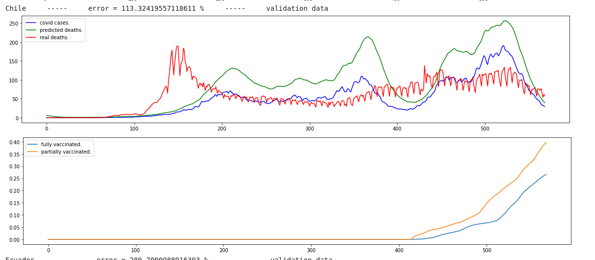
 

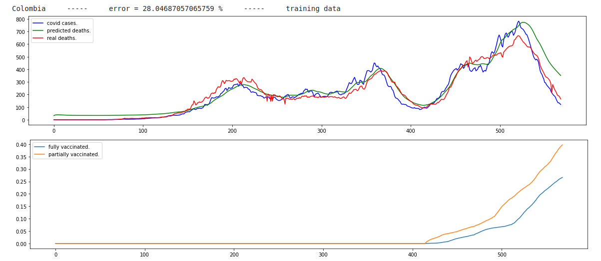
 

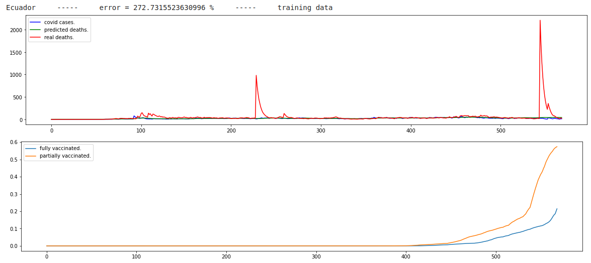
 

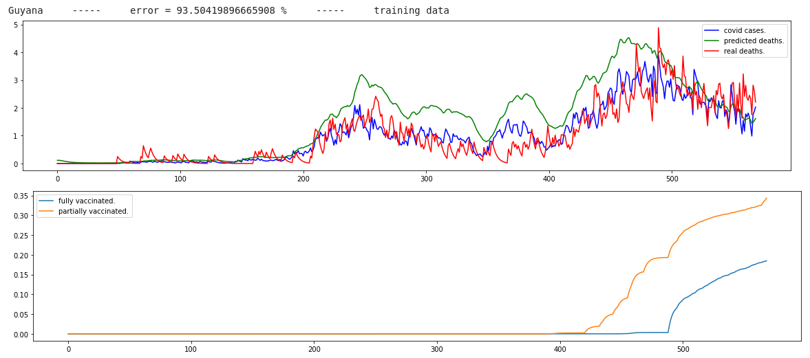
 

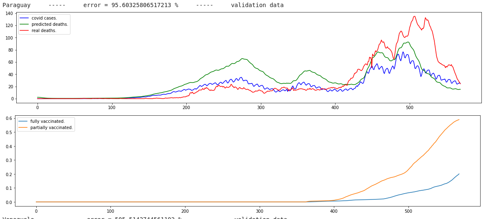
 

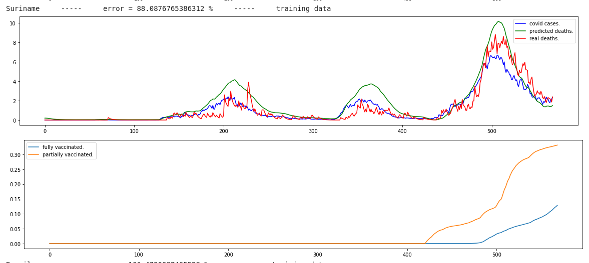
 

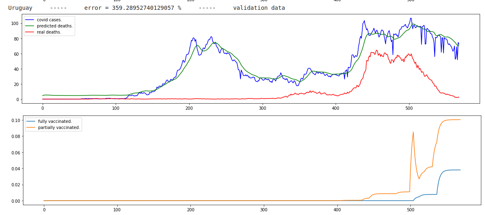

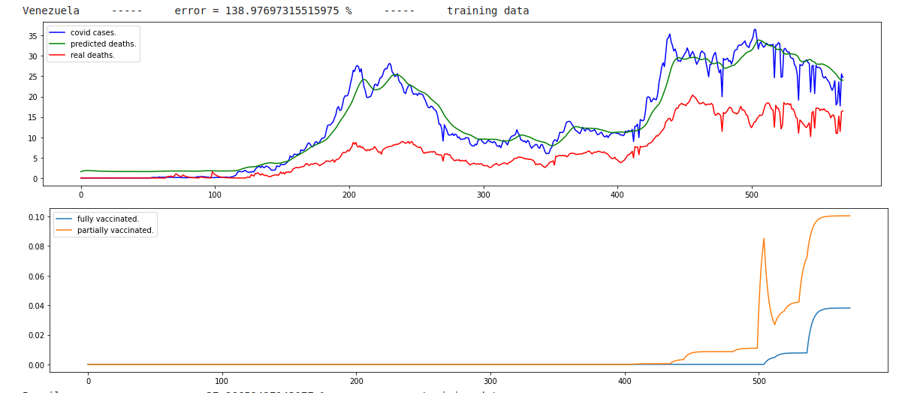

Be careful with the result because there are a lot of factors that could affect the data published by each country and territory. Lower COVID positive cases were found in countries that have been recognized for their success in responding to the COVID-19 pandemic, including New Zealand, Taiwan, Australia, Iceland, and South Korea. These countries have had high testing rates, comprehensive contact tracing programs, and relative success in mitigating the health impacts of the virus. It should be noted that while the estimates from this model showed substantial underreporting of infections tht affects the behavior of the curves, moreover, the overall period prevalence remained less than 10 percent in nearly all countries. Such a low proportion of the population presumably with antibodies is far from conferring herd immunity that may inhibit future disease transmission. 

It is important to note that, while these proportions are much higher than the officially reported cases, they do not represent herd immunity concept considered important to fully reopening society.

# Conclusion and Future work

This project is another way to evaluates the overall prediction of COVID-19 death cases in the current pandemic using a Recurrent Neural Network on reported data among 163 countries and territories. The RNN layer incorporated positive cases rate, fully vaccinated rate, partially vaccinated cases, and an estimate of daily death cases based upon reported death data by adjusting for heterogeneity and normalization by country population in testing levels, but the success of the model depends on the every country's health system capacity, and government transparency when its upload the data in World Health Organization system. The estimated death cases of COVID-19 are really dispersed from the previous empirical and epidemiological models, and the estimated error varies from a huge range for each country. National policies that facilitated open public testing and extensive contact tracing were significantly associated with higher values of COVID, which reflected improvements in the estimated detection. Extrinsic factors, including geographic isolation and centralized forms of government, were also shown to be associated with improved proposal model outcomes. Another way to generate a better fitting model is training the dataset for every country and use statistical and epidemiology adjustment.

We encourage other researchers to build on this analysis by combining this metric with other databases that can account for other possible factors, such as trust in government institutions, demographics, or urban/rural distribution. Such analyses could further elucidate other extrinsic factors related to COVID-19 daily death cases. Research could also be done to understand how association with other factors changes over time, as the pandemic progresses through different stages. Sub-national analyses may also be possible using the mathematical relationships defined. In order to decrease the prediction error in the model, a new model that combines the current Recurrent Neural Network (RNN) with an Statistical Neural Network (SNN), Probabilistic Neural Network (PNN), Radial Basis Function Neural Network (RBFNN), Generalized Regression Neural Network (GRNN), and Autoregressive Neural Network (NAR-NN). 

## John Hopkins notes:

### WHO COVID-19 Situation Reports

This folder summarizes the confirmed cases from WHO COVID-2019 situation reports. WHO defines the confirmed case as "a person with laboratory confirmation of 2019-nCoV infection, irrespective of clinical signs and symptoms. " (Source) Therefore, its data on and after Feb 13 should have a huge gap compared with our daily reports. In order to bring a more comprehensive picture of the current coronavirus situation, we create this folder, which will serve as a good complementary to our daily report and the dashboard.
Notes

* Time Zone: We assume that WHO reports in Geneva, Switzerland time (GMT+1). All date in this folder is in GMT+1.
* Update Frequency: We maintain this dataset at least twice a week.

### Data was obtained from: 2019 Novel Coronavirus COVID-19 (2019-nCoV) Data Repository by Johns Hopkins CSSE

This is the data repository for the 2019 Novel Coronavirus Visual Dashboard operated by the Johns Hopkins University Center for Systems Science and Engineering (JHU CSSE). Also, Supported by ESRI Living Atlas Team and the Johns Hopkins University Applied Physics Lab (JHU APL).

Visual Dashboard (desktop): [https://www.arcgis.com/apps/opsdashboard/index.html#/bda7594740fd40299423467b48e9ecf6](
https://www.arcgis.com/apps/opsdashboard/index.html#/bda7594740fd40299423467b48e9ecf6)

Visual Dashboard (mobile): [http://www.arcgis.com/apps/opsdashboard/index.html#/85320e2ea5424dfaaa75ae62e5c06e61](
http://www.arcgis.com/apps/opsdashboard/index.html#/85320e2ea5424dfaaa75ae62e5c06e61)

Lancet Article: An interactive web-based dashboard to track COVID-19 in real time

[Provided by Johns Hopkins University Center for Systems Science and Engineering (JHU CSSE):](
https://systems.jhu.edu/)

### Data Sources:

*    World Health Organization (WHO): https://www.who.int/
*    DXY.cn. Pneumonia. 2020. http://3g.dxy.cn/newh5/view/pneumonia.
*    BNO News: https://bnonews.com/index.php/2020/02/the-latest-coronavirus-cases/
*    National Health Commission of the People’s Republic of China (NHC):
*    http://www.nhc.gov.cn/xcs/yqtb/list_gzbd.shtml
*    China CDC (CCDC): http://weekly.chinacdc.cn/news/TrackingtheEpidemic.htm
*    Hong Kong Department of Health: https://www.chp.gov.hk/en/features/102465.html
*    Macau Government: https://www.ssm.gov.mo/portal/
*    Taiwan CDC: https://sites.google.com/cdc.gov.tw/2019ncov/taiwan?authuser=0
*    US CDC: https://www.cdc.gov/coronavirus/2019-ncov/index.html
*    Government of Canada: https://www.canada.ca/en/public-health/services/diseases/coronavirus.html
*    Australia Government Department of Health: https://www.health.gov.au/news/coronavirus-update-at-a-glance
*    European Centre for Disease Prevention and Control (ECDC): https://www.ecdc.europa.eu/en/geographical-distribution-2019-ncov-cases
*    Ministry of Health Singapore (MOH): https://www.moh.gov.sg/covid-19
*    Italy Ministry of Health: http://www.salute.gov.it/nuovocoronavirus
*    1Point3Arces: https://coronavirus.1point3acres.com/en
*    WorldoMeters: https://www.worldometers.info/coronavirus/

Additional Information about the Visual Dashboard: [https://systems.jhu.edu/research/public-health/ncov/](
https://systems.jhu.edu/research/public-health/ncov/)

### Terms of Use of John Hopkins:

This GitHub repo and its contents herein, including all data, mapping, and analysis, copyright 2020 Johns Hopkins University, all rights reserved, is provided to the public strictly for educational and academic research purposes. The Website relies upon publicly available data from multiple sources, that do not always agree. The Johns Hopkins University hereby disclaims any and all representations and warranties with respect to the Website, including accuracy, fitness for use, and merchantability. Reliance on the Website for medical guidance or use of the Website in commerce is strictly prohibited.
